# Builder Scan Report

_Generated: 2025-09-25T12:41:29.261Z_

Scanned 185 files under `apps/builder`.

## Node Insertion & Mutation

> Entry points that create, apply presets to, or otherwise mutate builder nodes.

- `insertNode` - `const insertNode(parentId: string, index: number, node: any) => void`  _apps/builder/stores/tree.ts:5_
- `applyPresetToNodes` - `function applyPresetToNodes(preset: InteractionPreset, nodes: T[], mode: ApplyMode) => T[]`  _apps/builder/lib/actions/apply.ts:158_
- `registerInsertAPI` - `function registerInsertAPI(fn: InsertAPI) => void`  _apps/builder/lib/bridge/insert.ts:14_
- `callInsertAPI` - `function callInsertAPI(parentId: string, index: number, node: any) => void`  _apps/builder/lib/bridge/insert.ts:21_
- `useSelectionStore` - `const useSelectionStore() => ExtractState<S>`  _apps/builder/stores/selection.ts:30_

## Selection & Current State Stores

> Selection stores and helpers tracking the active node, page, or project.

- `Builder` - `function Builder() => React.JSX.Element`  _apps/builder/app/page.tsx:28_
- `DevCanvas` - `function DevCanvas() => React.JSX.Element`  _apps/builder/components/figma/Canvas.tsx:196_
- `InteractionsTab` - `function InteractionsTab() => JSX.Element`  _apps/builder/components/rightpane/InteractionsTab.tsx:142_
- `useFigmaDevStore` - `const useFigmaDevStore() => ExtractState<S>`  _apps/builder/lib/figma/store.ts:268_
- `useBuilderStore` - `const useBuilderStore() => ExtractState<S>`  _apps/builder/stores/builder.ts:16_
- `useSelectionStore` - `const useSelectionStore() => ExtractState<S>`  _apps/builder/stores/selection.ts:30_

## Export & Serialization Pipeline

> Serialization, hashing, and export pipelines invoked when publishing or syncing.

- `serializeNodeAppendOnly` - `function serializeNodeAppendOnly(node: SerializableNode) => void`  _apps/builder/lib/export/serializeNode.append.ts:15_
- `serializeNode` - `function serializeNode(node: SerializableNode, level?: number) => string`  _apps/builder/lib/export/serializeNode.ts:51_
- `serializeNodes` - `function serializeNodes(nodes: SerializableNode[], level?: number) => string`  _apps/builder/lib/export/serializeNode.ts:70_
- `generateExport` - `function generateExport(slug: string) => Promise<{ contentHash: string; tsx: string; manifest: { id: string; generatedAt: string; nodes: number; }; tokens: s...`  _apps/builder/lib/export/generate.ts:24_
- `contentHash` - `function contentHash(obj: any) => string`  _apps/builder/lib/export/hash.ts:25_
- `contentHashBytes` - `function contentHashBytes(bytes: Uint8Array) => string`  _apps/builder/lib/export/hash.ts:30_
- `normalizeNode` - `function normalizeNode(input: any) => SerializableNode`  _apps/builder/lib/export/serializeNode.ts:74_
- `normalizeNodes` - `function normalizeNodes(input: any) => SerializableNode[]`  _apps/builder/lib/export/serializeNode.ts:115_
- `planZipSplit` - `function planZipSplit(files: Part[], limit: number) => Part[][]`  _apps/builder/lib/export/splitPlan.ts:2_
- `toSplitManifest` - `function toSplitManifest(parts: { size: number }[]) => { parts: { name: string; size: number; }[]; totalSize: number; }`  _apps/builder/lib/export/splitPlan.ts:32_
- `buildZipManifest` - `function buildZipManifest(files: ZipEntry[]) => ZipManifest`  _apps/builder/lib/export/zipManifest.ts:8_
- `buildZipManifestUnique` - `function buildZipManifestUnique(files: ZipEntry[]) => ZipManifest`  _apps/builder/lib/export/zipManifest.ts:17_
- `AuditPage` - `function AuditPage() => React.JSX.Element`  _apps/builder/app/audit/page.tsx:6_
- `BindingsEditor` - `function BindingsEditor({ node, pageRoot, onChange }: BindingsEditorProps) => React.JSX.Element`  _apps/builder/app/builder/components/BindingsEditor.tsx:23_
- `getSlotNodes` - `function getSlotNodes(page: Page, slot: SlotName) => ComponentNode[]`  _apps/builder/app/builder/diff.ts:60_
- `diffPage` - `function diffPage(oldPage: Page, newPage: Page, oldFrameId: string, newFrameId: string) => { titleChanged: boolean; frameChanged: boolean; slotDiffs: { slot:...`  _apps/builder/app/builder/diff.ts:67_
- `buildPreviewTree` - `function buildPreviewTree(page: Page, frameId: string) => ComponentNode[]`  _apps/builder/app/builder/utils.ts:23_
- `DataSourcesPage` - `function DataSourcesPage() => React.JSX.Element`  _apps/builder/app/data-sources/page.tsx:5_
- `DevActionsPage` - `function DevActionsPage() => React.JSX.Element`  _apps/builder/app/dev/actions/page.tsx:198_
- `Page` - `function Page() => React.JSX.Element`  _apps/builder/app/dev/export/page.tsx:10_
- `Page` - `function Page() => Promise<React.JSX.Element>`  _apps/builder/app/dev/exports/page.tsx:49_
- `Page` - `function Page() => React.JSX.Element`  _apps/builder/app/dev/figma/page.tsx:7_
- `EditPage` - `function EditPage() => React.JSX.Element`  _apps/builder/app/dev/pages/edit/page.tsx:17_
- `Page` - `function Page({ searchParams }: { searchParams?: Record<string, string | string[] | undefined> }) => Promise<React.JSX.Element>`  _apps/builder/app/dev/pages/page.tsx:69_
- `Page` - `function Page() => React.JSX.Element`  _apps/builder/app/dev/presets/page.tsx:6_
- `Page` - `function Page({ searchParams }: { searchParams?: { slug?: string } }) => Promise<React.JSX.Element>`  _apps/builder/app/dev/ui-audit/page.tsx:171_
- `EventsPage` - `function EventsPage() => React.JSX.Element`  _apps/builder/app/events/page.tsx:7_
- `ExportHashBadge` - `function ExportHashBadge() => React.JSX.Element | null`  _apps/builder/app/ExportHashBadge.tsx:15_
- `ExportHashCopyHotkey` - `function ExportHashCopyHotkey() => React.JSX.Element | null`  _apps/builder/app/ExportHashCopyHotkey.tsx:10_
- `RootLayout` - `function RootLayout({ children }: { children: React.ReactNode }) => React.JSX.Element`  _apps/builder/app/layout.tsx:25_
- `Builder` - `function Builder() => React.JSX.Element`  _apps/builder/app/page.tsx:28_
- `RecoConfirmedPage` - `function RecoConfirmedPage() => React.JSX.Element`  _apps/builder/app/reco-confirmed/page.tsx:7_
- `AutosaveMount` - `function AutosaveMount({ page, debounceMs = 800 }: Props) => null`  _apps/builder/components/AutosaveMount.tsx:18_
- `AutosaveMountHashed` - `function AutosaveMountHashed({ page, debounceMs = 800 }: { page: any; debounceMs?: number }) => null`  _apps/builder/components/AutosaveMountHashed.tsx:21_
- `CanvasRoot` - `function CanvasRoot({ children, className, fallbackActive, pageId }: CanvasRootProps) => React.JSX.Element`  _apps/builder/components/canvas/CanvasRoot.tsx:17_
- `CanvasRenderer` - `function CanvasRenderer({
  tree,
  runtime,
  builderManifest,
  isMetaMode = false,
  className,
}: CanvasRendererProps) => React.JSX.Element`  _apps/builder/components/CanvasRenderer.tsx:232_
- `ExportButton` - `function ExportButton({ getPage }: { getPage: () => any }) => React.JSX.Element`  _apps/builder/components/ExportButton.tsx:5_
- `ExportButtonDeterministic` - `function ExportButtonDeterministic({ getPage }: { getPage: () => any }) => React.JSX.Element`  _apps/builder/components/ExportButtonDeterministic.tsx:5_
- `ExportHashPreview` - `function ExportHashPreview({ page }: { page: any }) => React.JSX.Element`  _apps/builder/components/ExportHashPreview.tsx:12_
- `DEFAULT_BUILDER_MANIFEST` - `const DEFAULT_BUILDER_MANIFEST: import("C:/dev/uibuilder/packages/chizu-types/src/index").Page`  _apps/builder/lib/meta/builderManifest.ts:23_
- `loadBuilderManifest` - `function loadBuilderManifest() => Promise<Page>`  _apps/builder/lib/meta/storage.ts:36_
- `saveBuilderManifest` - `function saveBuilderManifest(manifest: Page) => Promise<void>`  _apps/builder/lib/meta/storage.ts:46_
- `generatePageCode` - `function generatePageCode(_args?: any[]) => any`  _apps/builder/shims/chizu-renderer-server.ts:2_

## Preview & Action Engine Boot

> Preview bridges and action engine bootstrapping hooks.

- `PREVIEW_API` - `const PREVIEW_API: Record<string, any>`  _apps/builder/app/builder/constants.ts:79_
- `buildPreviewTree` - `function buildPreviewTree(page: Page, frameId: string) => ComponentNode[]`  _apps/builder/app/builder/utils.ts:23_
- `Page` - `function Page() => React.JSX.Element`  _apps/builder/app/dev/export/page.tsx:10_
- `ActionPreview` - `function ActionPreview({ preset }: Props) => React.JSX.Element`  _apps/builder/components/actions/ActionPreview.tsx:13_
- `DiffPreview` - `function DiffPreview({ before, after }: { before?: string; after?: string }) => React.JSX.Element`  _apps/builder/components/common/DiffPreview.tsx:4_
- `ExportHashPreview` - `function ExportHashPreview({ page }: { page: any }) => React.JSX.Element`  _apps/builder/components/ExportHashPreview.tsx:12_
- `DataPanel` - `function DataPanel() => React.JSX.Element`  _apps/builder/components/rightpane/DataPanel.tsx:8_
- `DsTestPanel` - `function DsTestPanel() => React.JSX.Element`  _apps/builder/components/rightpane/DsTestPanel.tsx:6_
- `ActionEngine` - `class ActionEngine`  _apps/builder/lib/actions/engine.ts:132_
- `toRendererBindings` - `function toRendererBindings(map: Record<string, BindingSource | undefined>) => Promise<RendererBindingsResult>`  _apps/builder/lib/binding/resolve.ts:90_
- `preview` - `function preview(_key: string) => Promise<DsPreview>`  _apps/builder/shims/chizu-ui/ds/fetcher.ts:2_
- `useBuilderStore` - `const useBuilderStore() => ExtractState<S>`  _apps/builder/stores/builder.ts:16_

## Palette & Left Pane UI

> Palette, library, and asset panel entry points for the left pane.

- (no exported matches found)

## Component Registry & Compat

> Registry, compat, and handoff helpers resolving component definitions.

- `getComponentDef` - `function getComponentDef(id: string) => any`  _apps/builder/lib/registry/compat.ts:7_

## Drag & Drop Flows

> Palette-to-canvas drag, drop guides, and related DnD orchestration.

- `startPaletteDrag` - `function startPaletteDrag(ev: ReactDragEvent, compId: string) => void`  _apps/builder/lib/dnd/paletteToCanvas.ts:7_
- `handleCanvasDrop` - `function handleCanvasDrop(ev: DragEvent, deps: PaletteDropDeps) => void`  _apps/builder/lib/dnd/paletteToCanvas.ts:47_
- `ExportHashBadge` - `function ExportHashBadge() => React.JSX.Element | null`  _apps/builder/app/ExportHashBadge.tsx:15_
- `CanvasRoot` - `function CanvasRoot({ children, className, fallbackActive, pageId }: CanvasRootProps) => React.JSX.Element`  _apps/builder/components/canvas/CanvasRoot.tsx:17_
- `PerfPanel` - `function PerfPanel() => React.JSX.Element | null`  _apps/builder/components/debug/PerfPanel.tsx:7_
- `buildCss` - `function buildCss(node: Node) => string`  _apps/builder/lib/figma/css.ts:10_

## Node Factory Helpers

> Factories creating nodes from definitions or wrapping repeat structures.

- `handleCanvasDrop` - `function handleCanvasDrop(ev: DragEvent, deps: PaletteDropDeps) => void`  _apps/builder/lib/dnd/paletteToCanvas.ts:47_
- `CanvasRoot` - `function CanvasRoot({ children, className, fallbackActive, pageId }: CanvasRootProps) => React.JSX.Element`  _apps/builder/components/canvas/CanvasRoot.tsx:17_
- `createNodeFromDef` - `function createNodeFromDef(def: any, opts?: { slotKey?: string }) => NodeModel`  _apps/builder/lib/nodes/factory.compat.ts:12_
- `wrapRepeat` - `function wrapRepeat(tree: any, nodeId: string, dataPath: string, itemKey?: string) => any`  _apps/builder/stores/builder.ts:52_
- `unwrapRepeat` - `function unwrapRepeat(tree: any, nodeId: string) => any`  _apps/builder/stores/builder.ts:62_

## Serialize Hooks & Helpers

> Serialize append hooks and deterministic stringifying helpers.

- `serializeNodeAppendOnly` - `function serializeNodeAppendOnly(node: SerializableNode) => void`  _apps/builder/lib/export/serializeNode.append.ts:15_
- `stableStringify` - `function stableStringify(value: unknown) => string`  _apps/builder/lib/export/stableStringify.ts:15_
- `generateExport` - `function generateExport(slug: string) => Promise<{ contentHash: string; tsx: string; manifest: { id: string; generatedAt: string; nodes: number; }; tokens: s...`  _apps/builder/lib/export/generate.ts:24_
- `contentHash` - `function contentHash(obj: any) => string`  _apps/builder/lib/export/hash.ts:25_
- `buildZipManifest` - `function buildZipManifest(files: ZipEntry[]) => ZipManifest`  _apps/builder/lib/export/zipManifest.ts:8_
- `AutosaveMountHashed` - `function AutosaveMountHashed({ page, debounceMs = 800 }: { page: any; debounceMs?: number }) => null`  _apps/builder/components/AutosaveMountHashed.tsx:21_
- `encodeActionRules` - `const encodeActionRules(rules: ActionRule[]) => string`  _apps/builder/lib/actions/serialize.ts:188_

## Outbox & Queueing

> Outbox enqueue/flush flows, workers, and queue snapshots.

- `AutosaveBadge` - `function AutosaveBadge() => React.JSX.Element`  _apps/builder/components/AutosaveBadge.tsx:6_
- `SaveBadge` - `function SaveBadge(props: React.HTMLAttributes<HTMLDivElement>) => React.JSX.Element`  _apps/builder/components/common/SaveBadge.tsx:5_
- `PresetsPanel` - `function PresetsPanel({ slug }: { slug?: string }) => React.JSX.Element`  _apps/builder/components/rightpane/PresetsPanel.tsx:9_
- `saveDebounced` - `const saveDebounced(a?: T) => void`  _apps/builder/lib/save/applyAndSave.ts:36_
- `useAutosave` - `function useAutosave({ key, data, save, debounceMs = 600, enabled = true }: AutosaveOptions<T>) => void`  _apps/builder/src/hooks/useAutosave.ts:43_
- `useSaveStore` - `const useSaveStore() => ExtractState<S>`  _apps/builder/stores/saveQueue.ts:17_
- `recordSavedAt` - `function recordSavedAt(savedAt: number, lastWriteTs?: number) => void`  _apps/builder/stores/saveQueue.ts:72_

## Dependency Sketch

```mermaid
graph TD
  ExportHashBadge --> contentHash
  ExportHashCopyHotkey --> contentHash
  RootLayout --> ExportHashBadge
  RootLayout --> ExportHashCopyHotkey
  RootLayout --> AutosaveBadge
  RootLayout --> PerfPanel
  Builder --> diffPage
  Builder --> DEFAULT_BUILDER_MANIFEST
  Builder --> loadBuilderManifest
  Builder --> Page
  unwrapRepeat --> wrapRepeat
  useBuilderStore --> Builder
  useBuilderStore --> preview
  recordSavedAt --> useSaveStore
  useSelectionStore --> applyPresetToNodes
  generatePageCode --> Page
  AutosaveBadge --> useSaveStore
  AutosaveMount --> recordSavedAt
  AutosaveMount --> useAutosave
  AutosaveMountHashed --> recordSavedAt
  AutosaveMountHashed --> AutosaveMount
  AutosaveMountHashed --> useAutosave
  AutosaveMountHashed --> stableStringify
  CanvasRenderer --> Builder
  ExportButton --> Page
  ExportButtonDeterministic --> ExportButton
  ExportButtonDeterministic --> Page
  ExportHashPreview --> contentHash
  ExportHashPreview --> preview
  AuditPage --> Page
  getSlotNodes --> Page
  diffPage --> getSlotNodes
  diffPage --> Page
  buildPreviewTree --> Page
  DataSourcesPage --> Page
  EventsPage --> Page
  RecoConfirmedPage --> Page
  encodeActionRules --> stableStringify
  registerInsertAPI --> insertNode
  callInsertAPI --> insertNode
  generateExport --> contentHash
  generateExport --> stableStringify
  contentHash --> stableStringify
  contentHashBytes --> contentHash
  serializeNodeAppendOnly --> serializeNode
  serializeNode --> serializeNodeAppendOnly
  serializeNodes --> serializeNode
  normalizeNodes --> normalizeNode
  buildZipManifest --> contentHash
  buildZipManifest --> stableStringify
  buildZipManifestUnique --> buildZipManifest
  DEFAULT_BUILDER_MANIFEST --> Builder
  loadBuilderManifest --> Builder
  loadBuilderManifest --> DEFAULT_BUILDER_MANIFEST
  loadBuilderManifest --> Page
  saveBuilderManifest --> Builder
  saveBuilderManifest --> Page
  saveDebounced --> recordSavedAt
  saveDebounced --> useSaveStore
  ActionPreview --> ActionEngine
  ActionPreview --> preview
  CanvasRoot --> callInsertAPI
  CanvasRoot --> handleCanvasDrop
  CanvasRoot --> createNodeFromDef
  CanvasRoot --> getComponentDef
  SaveBadge --> useSaveStore
  DevCanvas --> useFigmaDevStore
  DataPanel --> Builder
  DataPanel --> useBuilderStore
  DataPanel --> preview
  DsTestPanel --> preview
  InteractionsTab --> useSelectionStore
  PresetsPanel --> saveDebounced
  PresetsPanel --> DiffPreview
  BindingsEditor --> PREVIEW_API
  BindingsEditor --> preview
  DevActionsPage --> Page
  Page --> AutosaveMount
  Page --> ExportButton
  Page --> ExportButtonDeterministic
  Page --> ExportHashPreview
  Page --> Page
  Page --> contentHash
  EditPage --> SaveBadge
  EditPage --> Page
```

